# Article Share: 《β2 Adrenergic-Neurotrophin Feedforward Loop Promotes Pancreatic Cancer》

> "In the middle of difficulty lies opportunity."  - <strong>Albert Einstein</strong>

 

​	In todays blog, I will make a depth profiling of the classical article "***β2 Adrenergic-Neurotrophin Feedforward Loop Promotes Pancreatic Cancer***" published  in ***《Cancer Cell》*** by [Timothy C.Wang](https://timothycwanglab.org/), leading expert in gastroenterology cancer research and patient care. It demonstrated the the β2 adrenergic neurotrophin oversecrection, abnormal level of the epinephrine and norepinephrine, stimulated by stress will promote pancreatic cancer iniation, development and progreesion. The graphical abstract of this article was catched in blow picture:

​	Furthrmore, the downstream molecules NGF or BDNF, not other neurotrophin such as GDNF, was digged out under stress condition and its effect leads to axonogenesis through Trk receptors (NGF-BDNF/Trk pathways) and further increased adrenergic input into the tumor microenvironment to form positive feedforward loop. The highlight of the research is the disease model construction. Here, I simplely list the disease model utilized in this article:

- Animal Disease Model
  - Environmal mouse model: Chronic Restraint Stress (CRS) mice;
  - Genetic mouse model: $\text{LSL-Kras}^{\text{+/G12D}};\text{Pdx1-Cre(KC)}$ mice, $\text{LSL-Kras}^{\text{+/G12D}};\text{LSL-Trp53}^{\text{+/R172H}};\text{Pdx1-Cre(KPC)}$ mice, ADRB2 knockout mice;
  - Surgical mouse model: Bilateral Adrenalectomy(ADx) mice;
  - Drug interruption mouse model: mice injected veinously by ICI118,551(selective β2-adrenergic receptor blocker), Isoproterenol(ISO, adrenergic receptor agonoist), atenolol(selective β1-adrenergic receptor blocker), propranolol(non-selective β2-adrenergic receptor blocker).

In addition, the oganoids derived from pancreatic cancer patient also was performed and validate the view.

​	In summary, this study on pancreatic ductal adenocarcinoma (PDAC) highlights the critical role of nerves in cancer development. Specifically, the research demonstrates the significant impact of systemic stress and elevated catecholamine levels during the early stages of PDAC progression. The findings suggest that targeting ADRB2 and/or Trk receptors could serve as a promising preventive or therapeutic approach for PDAC, a malignancy for which more effective treatments are urgently needed.

------

​		

## 1 Background

The section provides some basic and necessary research background and intention about this article.

### 1.1 The Initiation and Poor Progonsis of PDAC

​	The initiation of PDAC have been investigated for many years. A recent review article outline the pancreatic cancer putative cells of origin. Anatomically, The pancreatic cell was divided into two types: **acinar cells** and **ductal cells** according to cell morphology. In early development stage, oncogene mutation and tumor suppressor loss such as KRAS,TP53 drives the precursor lesions of pancreatic tissue from low level to high level. Eventually, The PDAC was formed and classified into three types: classical, basal-like and hybrid types accoding to origin of cancer cells.

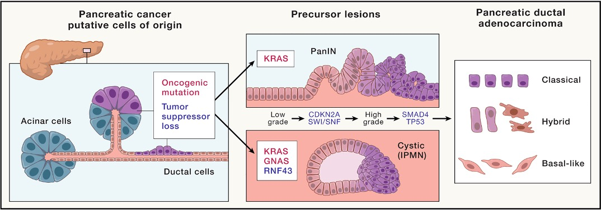

​	The reason why average prognosis of PDAC patient is 5 years extremly confused clinical doctor and research scientist. It drives so many groups to explore the underlying reseaon. 

Up to date, some pointview have been proposed and validated:

- **Late Diagnosis**: PDAC is often diagnosed at an advanced stage, typically when the cancer has already spread beyond the pancreas to other organs.
- **Lack of Early Detection Methods**: There are no effective screening tools for PDAC, and current diagnostic methods, like imaging or biopsy, may miss early-stage tumors.
- **Aggressive Nature of the Disease**: PDAC is characterized by rapid growth and early metastasis.
- **Poor Response to Treatment**: PDAC is notoriously resistant to conventional therapies like chemotherapy and radiation.
- **Limited Surgical Options**: The majority of PDAC patients are not candidates for surgery because the tumor has already spread or is located in an inoperable part of the pancreas.

Ongoing research into early detection, targeted therapies, and better understanding of the tumor microenvironment are crucial to improving survival outcomes. For this target, many scientist fous on the PDAC.

### 1.2 The New Interdiscipline of Cancer and Neuroscience: Cancer Neuroscience

​	In recent decades, interdiscipline research made great success in many research field includes the cross of cancer diagnosis, pathogenesis, treatment and neuroscience. The research timeline can be traced to late 19th century:

Here, I also summary some key research finding and developments:

- **Early Foundations (1900s - 1970s)**:
  - **Initial Discovery of Cancer and Nervous System Interactions**:
    - Early studies began to hint at connections between the nervous system and cancer. However, research was fragmented and primarily focused on cancer biology and the nervous system separately.
    - **1920s-1930s**: Early neurobiological studies on how tumors might affect neural tissues or cause symptoms in patients, such as paraneoplastic syndromes.

- **Cancer Neurobiology (1980s - 1990s)**:
  - **Recognition of Tumor-Intrinsic Neural Interactions**:
    - **1980s**: Emerging interest in the role of the nervous system in tumor growth, especially through neurochemicals like neurotransmitters and hormones. Studies started linking the central nervous system (CNS) and cancer progression.
    - **1990s**: Research began focusing on how neurotrophic factors (like NGF, BDNF) could affect cancer cell behavior. Some studies showed that cancer cells could exploit the nervous system’s signaling mechanisms for metastasis.

- **Neurogenesis and Cancer (2000s)**:
  - **Growing Understanding of Cancer’s Effects on the Nervous System**:
    - **2000s**: Studies started to show how tumors could influence the brain and nervous system via neural networks, causing pain, cachexia, and cognitive dysfunction. Understanding of how tumors can induce changes in neural function and structure grew.
    - Development of models investigating the role of **neuroinflammation** in cancer progression and metastasis, especially in relation to brain metastases.

- **Neuro-oncology Emerges as a Specialty (2010s)**:
  - **Rise of Cancer Neuroscience**:
    - **2010s**: Neuro-oncology emerged as an interdisciplinary field, combining cancer research with neuroscience to understand how the nervous system influences cancer, and vice versa.
    - **Neuroinflammation and Tumor Growth**: Increased focus on the impact of inflammatory responses in the CNS, the blood-brain barrier, and cancer metastasis to the brain. Neuroinflammation became recognized as a significant contributor to cancer progression, including glioblastomas.
    - **Cancer Pain Research**: The role of the nervous system in modulating cancer pain, particularly in conditions like pancreatic cancer or metastatic bone disease, received more attention.

- **Current Trends and Future Directions (2020s and beyond)**:
  - **Cancer Neuroscience and Immune Therapy**:
    - **Targeting Neural Mechanisms in Cancer Treatment**: Recent studies are exploring how targeting neurotrophic factors, neural signaling pathways, or neural-immune interactions can enhance cancer treatments.
    - **Personalized Medicine and Neuroscientific Advances**: Advances in precision medicine have encouraged the development of targeted therapies that account for neural-tumor interactions. Additionally, research into how cancer treatment may affect the brain (e.g., chemotherapy-induced cognitive decline) has grown.
    - **Cancer-Related Cognitive Dysfunction**: More attention is being paid to the neurocognitive effects of cancer treatment, particularly after chemotherapy (commonly referred to as "chemo brain").

### 1.3 The Cancer Neuroscience in PDAC

​	Cancer neuroscience in pancreatic ductal adenocarcinoma (PDAC) examines how the nervous system influences tumor development, progression, and patient symptoms. Understanding these interactions is crucial for developing effective treatments for this aggressive cancer.

#### 1.3.1 Key Aspects of Cancer Neuroscience in PDAC

​	The first key aspects of cancer neuroscience is remarkable and notable phenomenon that spread of cancer cells along the nerves named **Perineural Invasion (PNI)**. Here, the arrow show PNI node composed by neural sheats

The concept was initially proposed by Drapiewski *et al* and proved in proliferative breaset disease. More than a century ago and was regarded as the fifth route of cancer spread, in addition to the four well-known ways: direct invasion to surrounding tissues, lymphatic metastasis, hematogenous metastasis, and seeding along body cavities. Since then, PNI has been identified in various malignancies, including head and neck cancers, pancreatic ductal adenocarcinoma (PDAC), colorectal cancer, and prostate cancer. PDAC often exhibits perineural invasion, where cancer cells invade nerves, facilitating tumor growth and metastasis. This interaction between nerves and cancer cells is a significant factor in PDAC progression.

​	Due to it's unique anatomical positioning, sensory nerves, particularly those releasing calcitonin gene-related peptide (CGRP), play a role in PDAC called **Sensory Nerve Involvement**. Elevated CGRP levels are associated with increased cancer pain and tumor progression. Studies have shown that reducing CGRP+ sensory neurons can impede disease progression and alleviate pain. This is primary reason that extreme cancer pain often attacked in late or Late stage highly malignant PDAC patients. The latest research about the uncover the [characterization of single neurons reprogrammed by pancreatic cancer show the neurons enrichments](https://www.nature.com/articles/s41586-025-08735-3) in PDAC pancreas compare to normal organ by PRPH stain method:

​	In addition, **Neuroplastic changes** occur, including increased expression of pancreatic neurotrophic factors and sensory innervation in early PDAC development. These changes may contribute to tumorigenesis and offer potential targets for therapy. In todays research article share, we will observe that the oversecreted catecholamines promote PDAC initiation and progression under chronic stress restraint.

​	**Mathematical Modeling** have been developed to simulate nerve-tumor interactions in PDAC. These models help understand how different types of axons (sympathetic or sensory) influence tumor progression and can guide therapeutic strategies targeting the nervous system.	

Understanding these interactions is crucial for developing effective treatments for this aggressive cancer.

#### 1.3.2 Implications for Treatment

Understanding the role of the nervous system in PDAC opens avenues for novel therapeutic approaches:

- **Targeting Nerve-Cancer Interactions:** Interventions that disrupt the communication between nerves and cancer cells could slow tumor growth and alleviate pain.
- **Modulating Sensory Nerve Activity:** Controlling the activity of sensory nerves, particularly those releasing CGRP, may reduce cancer-related pain and inhibit tumor progression.
- **Utilizing Mathematical Models:** Computational models can predict the effects of nerve-targeted therapies, aiding in the design of clinical trials and personalized treatment plans.

### 1.4 Organoids

​	**Organoids** are three-dimensional (3D) clusters of cells that mimic the structure and function of actual organs in the body. These miniaturized, simplified versions of organs are grown in vitro (in a lab) and can replicate key characteristics of the tissues they represent, making them powerful tools for research, drug testing, and disease modeling.

#### 1.4.1 The Characteristics of organoids

​	The organoids has unique ability to model human diseases more accurately than traditional 2D cultures makes them invaluable for research and personalized medicine. 

- **3D Culture**: Unlike traditional 2D cell cultures, organoids are grown in 3D structures that allow cells to organize themselves into more complex patterns, similar to what happens in vivo (inside the body).
- **Self-organization**: Organoids develop spontaneously through the ability of stem cells to differentiate into various cell types and self-organize into tissue-like structures. This self-organizing feature is a critical characteristic that distinguishes organoids from simpler cell cultures.
- **Tissue Resemblance**: They can replicate some of the basic architecture and functionality of organs. For example, brain organoids can mimic neural structures, while intestinal organoids can mimic the function of the human gut.
- **Stem Cell Derived**: Most organoids are derived from pluripotent stem cells (embryonic stem cells or induced pluripotent stem cells), or adult stem cells, which have the potential to differentiate into a variety of cell types.
- **Expensive Cost**: organoids technology can be quite expensive, and this cost can be a barrier for widespread adoption in research and clinical applications. Several factors such as stem cell resource,  specialized growth conditions, longer time and maintenance, complexity in scaling, reproducibility and standardization contribute to the high cost of generating and maintaining organoids together.

​	As the technology matures, organoids are becoming an exciting advancement in biomedical research, offering more realistic and functional models of human tissues and organs. They have a broad range of applications in disease modeling, drug development, and potentially even in personalized treatments. However, for now, they remain a premium research tool, especially for applications in drug discovery, disease modeling, and regenerative medicine.

#### 1.4.2 Common Types of Organoids

​	Up to date, only several types of organoids, brain,intestine, liver, kidney, cancer, have been cultured largely and applied in biomedical research boardly. Each type of organoid have their unique application. **Brain organoids**  mimic aspects of the human brain, including neural development and certain brain functions, useful for studying neurological diseases and brain development. **Intestinal organoids** represent parts of the gut and are used to study digestion, gut diseases, and microbiome interactions. **Liver organoids** replicate the structure of the liver and are used to study liver diseases and drug metabolism. **Kidney organoids** simulate kidney structures, useful for studying renal diseases and kidney development. **Cancer organoids** derived from cancer patients' tissues were used to imitate tumor growth, metastasis, and responses to treatments.

#### 1.4.3 Applications of Organoids

Actually, the application of organoids is similar to cell experiment. It roughly includes diverse aspects:

- **Disease Modeling**: Organoids can be used to model a variety of diseases, such as cancer, neurodegenerative diseases, or genetic disorders, providing insights into disease mechanisms and progression.
- **Drug Discovery and Testing**: Organoids are used for high-throughput drug screening and testing, as they provide a more realistic environment for evaluating drug effects than traditional 2D cell cultures.
- **Personalized Medicine**: Cancer organoids, for example, can be grown from a patient's tumor, allowing researchers to test various drugs and identify the most effective treatment tailored to the individual.
- **Developmental Biology**: Organoids are valuable for studying how organs develop and form during embryogenesis, helping to answer basic questions in developmental biology.
- **Tissue Engineering**: In the long term, organoids have the potential to contribute to regenerative medicine and organ transplantation, though they are still in early stages.

​	

​	In summary, integrating cancer neuroscience into PDAC research enhances our understanding of tumor biology and opens new therapeutic possibilities by targeting the complex interactions between the nervous system and cancer cells.

------

## 2 Results

### 2.1 Chronic Neuropsychological Stress Promotes Kras-Induced Pancreatic Tumorigenesis, which is regulated by ADRB2

​	The begining of the story is from the finding that **upregulated the level of epinephrine** and **higher sroces of PanINs** in CRS mice model (mice treated by chronic restraint stress in 14 weeks, 6 hr/day - 5 days/week). Because of the upregulated epinephrine and β2-adrenergic receptor (ADRB2) is reported to be the major mediator for chronic-stress-induced cancers, including PDAC, the authors investigated the effects of ADRB2 in stressed or unstressed mice by receptor agonist(ISO injection), receptor antagonist(ICI injection), ADRB2 knouck-out, bilateral adrenalectomy(ADx). The pathogical pancreatic H&E images demonstrated the disoganization of the pancreas and recoveried morph change i

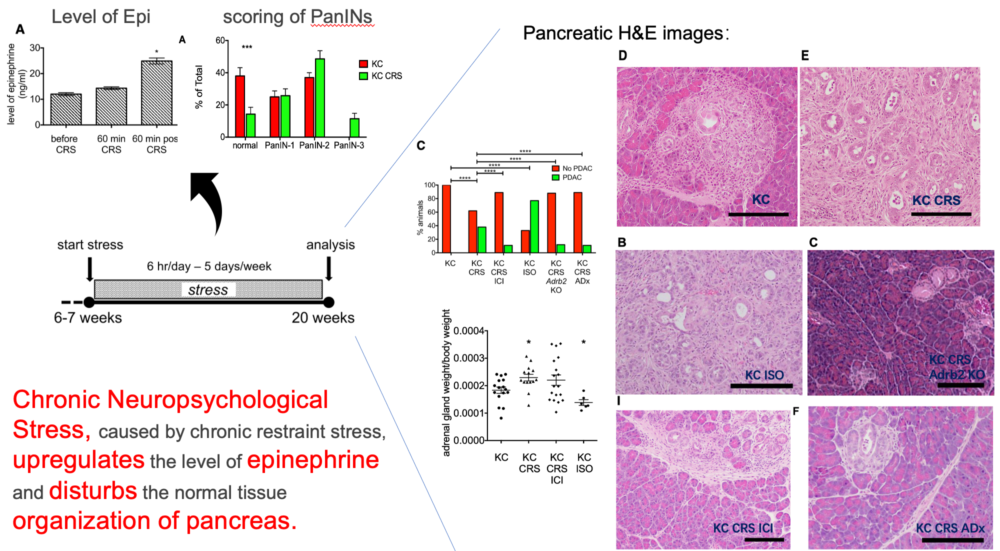

Subsequently, quantitative measurement of ADRB family genes includes ADRB1, ADRB2, ADRB3 were performed. The qPCR outcomes indicated the ADRB2 is higher expression in KC mice and validated in ADRB2 IHC in these mouse.

​	In the next step, the authors infer that whether percentage of neural components secreting Epi is cosistent with observation above. The peripherin IHC was tested:

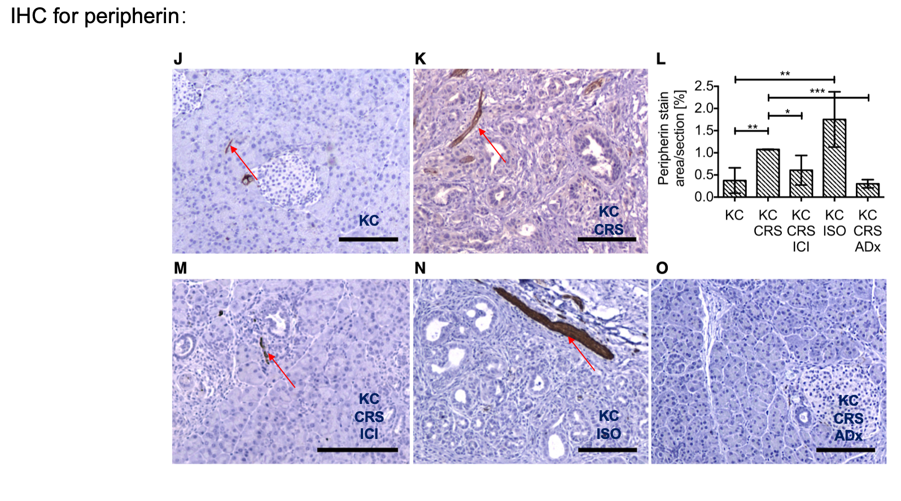

The statistical ratio pattern of peripherin by IHC stain is consistent with incidence of PDAC.

​	Taken together, these results suggest that **chronic stress and increased circulating catecholamines lead to an expansion of intrapancreatic nerves.** But we still don't know the reason why upregulation of ADRB2 expression and neuron density in PDAC sample contribute to transition from early stage PanIN to late stage PanIN.

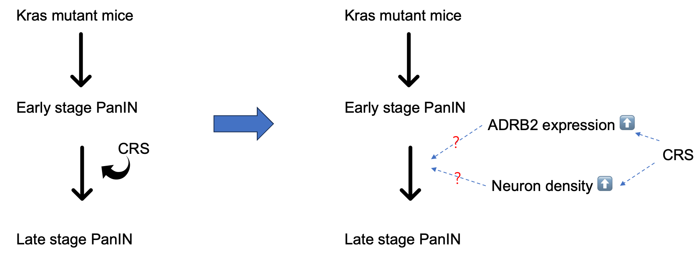

### 2.2 ADRB2 Blockade Significantly Increases Overall Survival in KPC Mice

​	To further verify the ADRB2 Blockage effects in **spontaneous PDAC model**, authros utilized the **LSL-*Kras*^+/LSL-G12D^;LSL-*Trp53*^+/R172H^;*Pdx1*-Cre (KPC) model**, which develops early PanIN lesions at 7–9 weeks of age, advanced PanIN lesions at 13–15 weeks, and PDAC by 17–19 weeks. The authors design the same experiment(H&E stain, IHC stain, qPCR) to prove the significant neural invasion in the KPC mice model.

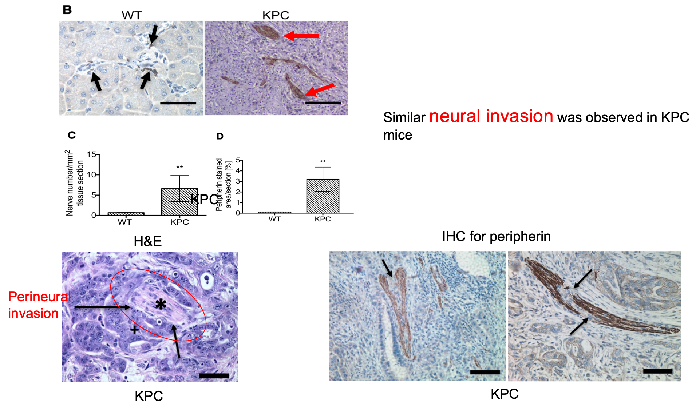

The H&E images and statistics(Nerve number, Peripherin), qPCR gene quantity demonstrate the similar morphylogical and gene change in KPC mice. 

​	While the **Peripherin** is an intermediate filament protein primarily expressed in the **peripheral nervous system**, especially in **sensory neurons**, **motor neurons**, and some **sympathetic neurons**, it is not clear the sensory neurons or motor neurons contribute the efforts. So, the authors use the TH^+^ antibody to stain sympathetic neurons selectively to analyse the whether the sympathetic outputs is enlarge. 

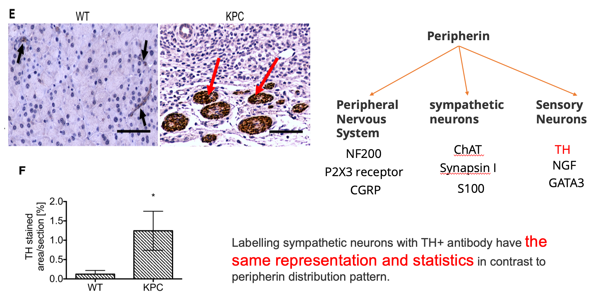

Labelling sympathetic neurons with TH^+^ antibody have the same representation and statistics in contrast to peripherin distribution pattern.

The pancreatic ADRB2 IHC and qPCR in PDAC from KPC mice was carried out in various treatment group. As expected, ADRB2 is upregulated because of negative feedback regulation of receptors and distributes within ductal cells in PDAC tissue.

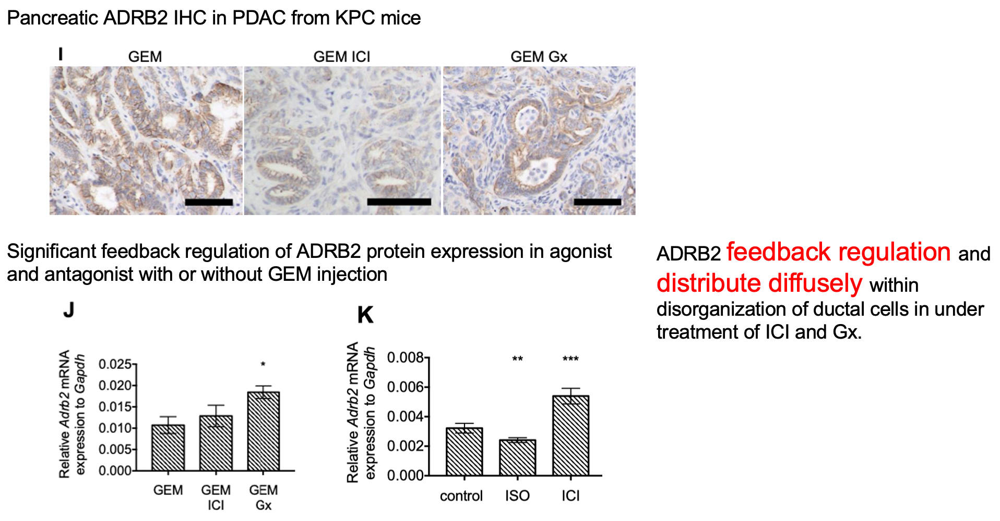

For poor prognosis of pancreas of PDAC also be improved in some extent in treatment of ICI and ganglionectomy(Gx).

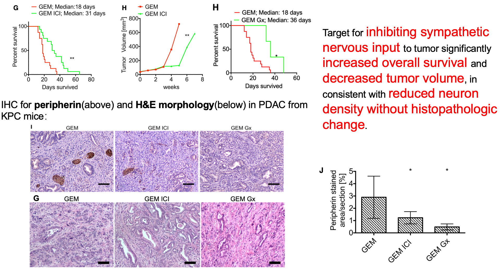

Targeting for inhibiting sympathetic nervous input to tumor significantly increased overall survival and decreased tumor volume, in consistent with reduced neuron density without histopathologic change.

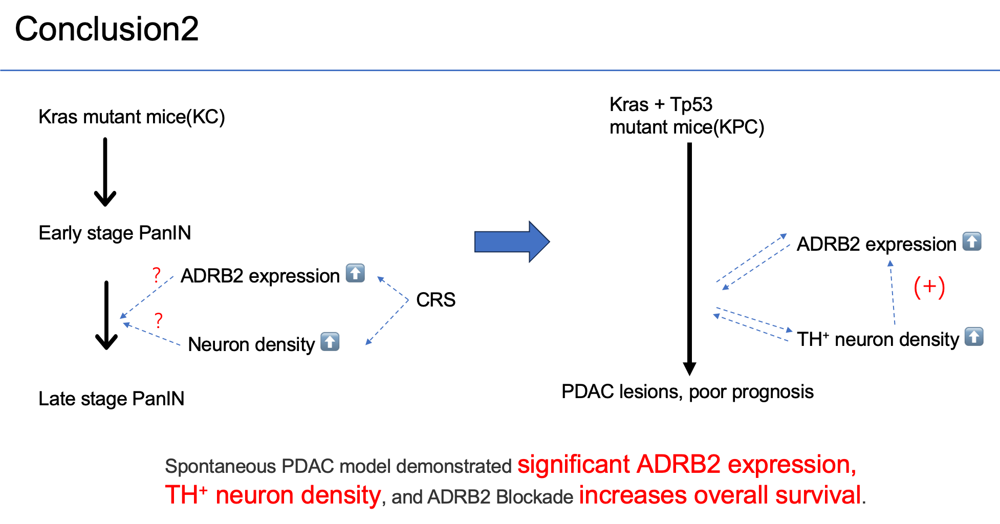

### 2.3 Catecholamines Promote Acinar to Ductal Metaplasia and Drive Proliferation

​	From the graphical conclusion of last subchapter, It clarified the logical cycle: **increased TH^+^ neuron density (e.g. place the mouse into stress environment) -> upregulated ADRB2 expression -> Exacerbated PDAC lesions**. However, the downstream event triggerd by upregulated ADRB2 receptor, a member of adrenergic family, is unknown. Therefore, authors investigated the underlying mechanisms by which adrenergic signaling stimulates PDAC development.

​	To discover the downstream of ADRB2, organoids we introduced briefly above was choosen to mimic the tumor environment. Organoids derived from KC mice was deal with the following drugs:

|       Drugs        |                        Efforts                         |
| :----------------: | :----------------------------------------------------: |
| Isoproterenol(ISO) |  **Non-selective** β adrenergic receptor **agnoist**   |
|    Propranolol     | **Non-selective** β adrenergic receptor **antagnoist** |
|      Atenolol      |  **Selective** β1 adrenergic receptor **antagnoist**   |
|  ICI118,551(ICI)   |  **Selective** β2 adrenergic receptor **antagnoist**   |

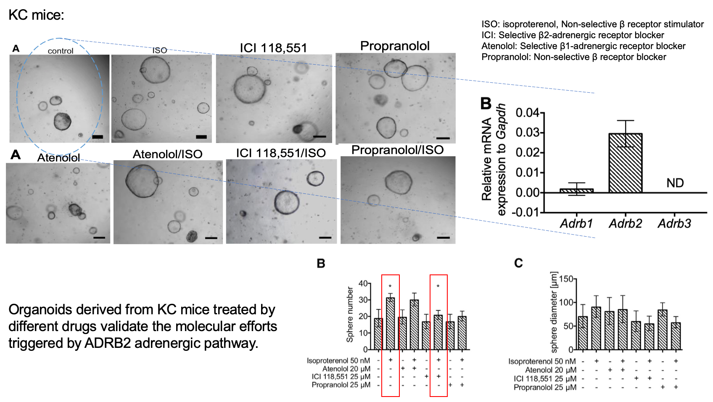

The bright field images and statistics of number and diameter of organoids validate the molecular efforts triggered by ADRB2 adrenergic pathway shown in figure above. Though recovery organoids experiment deleted ADRB2 gene derived from KC-ADRB2 KO mice, authors confirmed ADRB2 adrenergic efforts in other side.

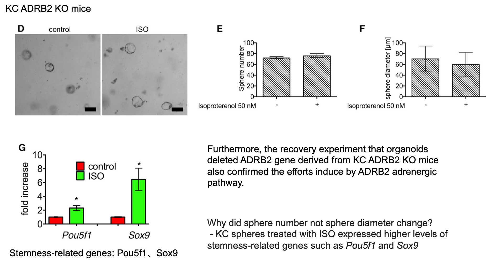

Furthemore, to investigate the reason why the organoids number not diameter increased by ISO, stemness-related genes *Pou5f1*, *Sox9* were measured. It indicates the potential stemness ability was elevated, which hinted the potential molecular mechanism underly the finding.

​	Previous finding indicates the underlying downstream of ADRB2 receptor encompass numerous pathway: cAMP-PKA, MAPK/ERK *etc*. To further explore potential downstream molecular signaling pathways activated by ADRB2 receptor, 

  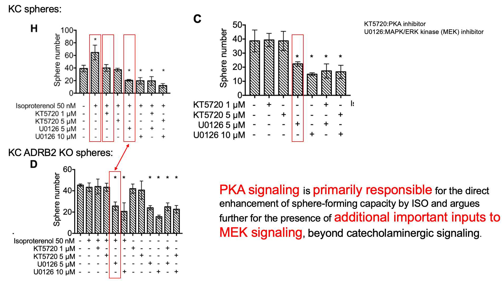
  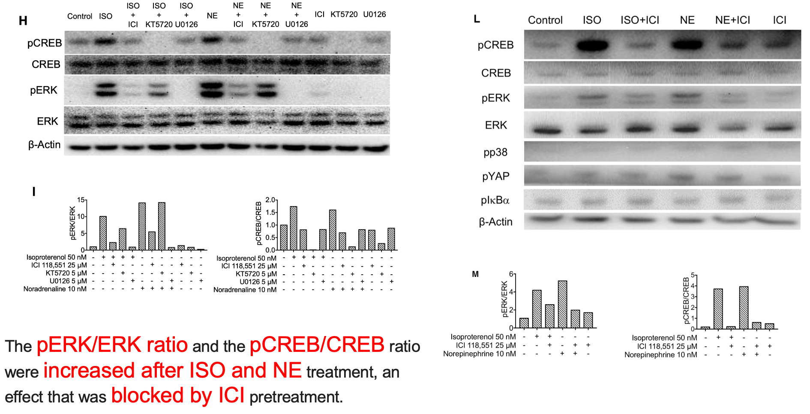

​	Next,the elative quantification of ADRB1-3 mRNA expression and ADRB2  fluorescence co-location were prepared in human pancreatic cancer cell lines AsPC-1, BxPC-3, Mia PaCa-2 and Panc-1. Also, the similar block effects exhibits in these cell lines treated by agnoist and antagnoist.

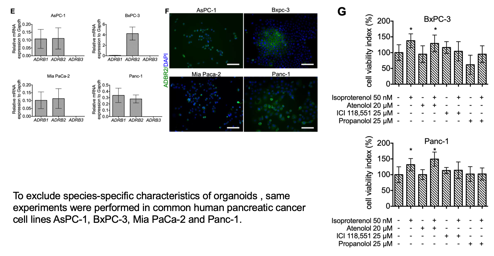

​	In addition, authors design the co-culture model to explore whether the small mocule derived from DRGs has the similar effects to spheres. Obviously, it is true! It demostrate the another endogenous source of except by autocrine mechanism.

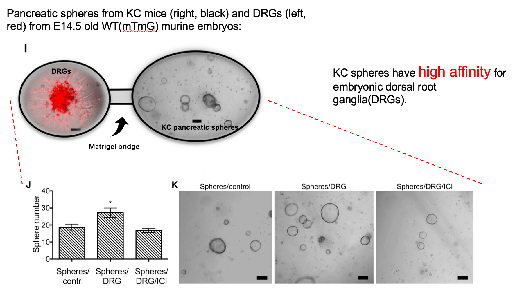

​	As a result, 

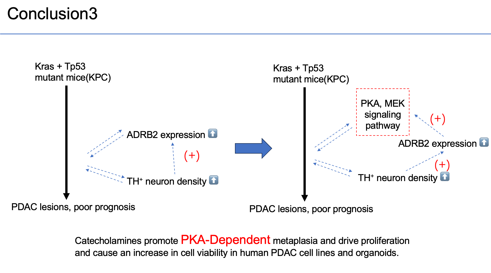

### Adrenergic Signaling Increases Neurotrophin Secretion and Promotes PDAC Development through Tumor-Associated Axonogenesis

​	

## Refercence
