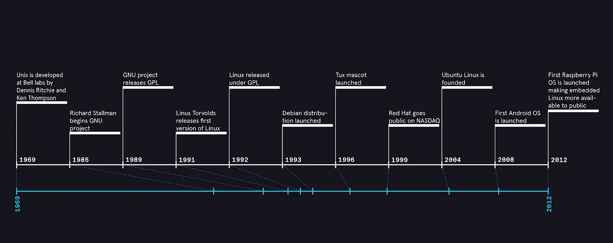

# Linux System Learning (I)

## 1. Chapter 1: Linux Overview

### 1.1 What is Linux

Linux is a Unix-like operating system composed of a kernel and a series of software tools. Initially released by Linus Torvalds in 1991, Linux has evolved into a powerful, stable, and open-source operating system with contributions from developers worldwide. Its open-source nature allows for free viewing, modification, and distribution of the source code, leading to numerous customized Linux distributions like Ubuntu, CentOS, and Debian.

Linus Torvalds, the creator of Linux

### 1.2 The History of Linux

Linux, the renowned open-source operating system, boasts a fascinating and eventful history. It all began in 1991 when a young computer science student named *Linus Torvalds* from the University of Helsinki in Finland embarked on a journey to create an operating system kernel that would eventually revolutionize the tech world.

source: https://miro.medium.com/v2/resize:fit:1400/format:webp/1*0IFhRKvx6T7tC0Atf7a91g.png

Initially, Torvalds was inspired by MINIX, a small UNIX-like operating system designed for educational purposes. However, he envisioned something more scalable and flexible. On August 25, 1991, he announced the Linux project in a Usenet post, describing it as "a free operating system kernel" and inviting developers to contribute.

The initial version of Linux, 0.01, was released in September 1991. It was rudimentary but laid the foundation for what was to come. As the project gained traction, developers worldwide started contributing code, adding features, and improving stability. By October 1991, Linux version 0.02 was released, incorporating significant enhancements and additional functionality. This rapid development cycle continued, with each new version bringing the operating system closer to being a viable alternative to proprietary systems.The Linux logo, featuring a penguin named Tux, was introduced in 1996. Tux, designed by Larry Ewing, has since become the beloved mascot of the Linux community, symbolizing the system's friendly and approachable nature.Throughout the 1990s, Linux evolved from a hobby project into a robust operating system supported by a global community of developers. The open-source model enabled collaborative innovation, allowing programmers to share improvements and modifications freely.The early 2000s witnessed Linux's expansion beyond servers into desktop and embedded systems. Distributions like Ubuntu, Fedora, and Debian made Linux more accessible to non-technical users, while Android brought Linux into the mobile arena.

Today, Linux powers everything from smartphones and routers to supercomputers and cloud infrastructure. Its versatility and adaptability have made it a cornerstone of modern technology.The story of Linux is not just about an operating system but about the power of collaboration, openness, and the community-driven approach to innovation.

### 1.3 The Purposes of Linux

Linux plays a crucial role in modern computing, with applications ranging from personal computers to supercomputers. As a Unix-like operating system, Linux is favored globally for its open-source, customizable, and efficient nature. It excels in server environments, cloud computing, embedded systems, supercomputing, and even desktop applications, demonstrating remarkable adaptability. Here are its key applications:

- **Server Field**: Dominating the server market, Linux is widely used in web, database, and mail servers. Its stability and security enable enterprises to handle numerous network requests and data storage tasks efficiently while reducing operational costs.
- **Cloud Computing and Virtualization**: Linux is central to cloud infrastructure. With lightweight container technologies like Docker and virtualization solutions like KVM, it offers efficient resource management and application deployment for cloud providers and enterprises.
- **Embedded Systems**: Linux is common in embedded devices such as smartphones (e.g., Android), routers, and IoT devices. Its customizability and open-source nature allow developers to optimize it for specific hardware and functional requirements.
- **Supercomputing**: Most supercomputers globally run on Linux. Thanks to efficient process scheduling, robust file systems, and support for large-scale parallel computing, Linux meets the demands of high-performance computing in scientific research and data analysis.
- **Desktop Applications**: Though less prevalent on desktops, Linux provides a stable, secure, and highly customizable OS option. It appeals to open-source enthusiasts, developers, and professionals, with sufficient software support for daily tasks like office work, graphic design, and audio/video editing.

### 1.4 Why Linux is Essential for Programmers

In today's software development and IT sector, Linux is a must-have tool for programmers. It offers a highly efficient, flexible, and stable environment for server management, application development, and system administration. Familiarity with Linux is vital for various programming tasks, and its importance is detailed below:

- **Open-Source Advantage**: Programmers can freely access and modify Linux source code, aiding in understanding OS internals and enabling customized development based on project needs. This cultivates problem-solving and innovative thinking.
- **Rich Development Tools**: Linux provides extensive and powerful development tools like GCC, GDB, and Make. It supports development environments for almost all mainstream programming languages, enhancing code writing, debugging, and optimization efficiency.
- **Dominance in Server-Side**: Given Linux's prevalence in servers, backend development, server deployment, and maintenance require Linux expertise. This skill is essential for tasks like setting up web servers (e.g., Apache, Nginx), configuring databases (e.g., MySQL, PostgreSQL), and optimizing server performance and security.
- **Strong Community Support and Rich Learning Resources**: Linux benefits from a large, active open-source community. Programmers can access extensive documentation, tutorials, forum discussions, and open-source projects. This collaborative environment aids quick problem-solving and continuous skill enhancement.
- **Stability and Security**: Linux's stability and security minimize interruptions and risks from system failures or vulnerabilities, providing a solid foundation for developing reliable and efficient software applications, especially in critical business and sensitive data scenarios.
- **Cross-Platform Capability**: Linux integrates and interoperates seamlessly with other operating systems and hardware platforms. This ensures code portability and compatibility, offering flexibility in development and deployment across different environments.

### 1.4 How Does Linux Work?

Linux is an operating system that manages computer hardware and software resources, providing essential services to applications and users. Understanding how Linux works involves exploring its architecture, components, and the interactions between them.

#### 1.4.1 Architecture

Linux follows a multi-layered architecture, with each layer serving specific functions:

- **Kernel**: The core component, handling process management, memory allocation, device drivers, and system calls.
- **System Libraries**: Provide pre-written code for applications to use, simplifying development.
- **System Utilities**: Tools for managing the system, such as file management, user administration, and network configuration.
- **User Interface**: Can be command-line (CLI) or graphical (GUI), allowing users to interact with the system.

#### 1.4.2 Key Components

##### 1.4.2.1 Kernel

The Linux kernel is responsible for:

- **Process Management**: Creating, scheduling, and terminating processes.
- **Memory Management**: Allocating and deallocating memory for processes.
- **Device Drivers**: Enabling hardware interaction.
- **File System**: Organizing and storing data on storage devices.

##### 1.4.2.2 System Calls

These are interfaces allowing applications to request services from the kernel, such as reading/writing files or creating processes.

#####  1.4.2.3 Shell

The shell interprets user commands, executing them via the kernel. Examples include Bash and Zsh.

##### 1.4.2.4 Daemons

Background processes managing services like printing or web serving.

####  1.4.3 Boot Process

- **BIOS/UEFI**: Initializes hardware and loads the bootloader.
- **Bootloader**: Loads the kernel into memory.
- **Kernel Initialization**: Sets up hardware and starts the first user-space process, typically `init`.
- **System Initialization**: Starts system services and daemons.
- **Login Prompt**: Presents the user with a login interface.

####  1.4.4 File System

Linux uses a hierarchical file system:

- **Root (`/`)**: Top-level directory containing all other files and directories.
- **`/bin`**: Essential user binaries.
- **`/etc`**: System configuration files.
- **`/home`**: User directories.
- **`/var`**: Variable data like logs.
- **`/proc`**: Virtual files providing system information.
- **`/dev`**: Device files.

#### 1.4.5 Execution of a Command

When a user enters a command:

1. **Shell Parsing**: The shell analyzes the command.
2. **Path Search**: Looks for the command in directories listed in the `PATH` variable.
3. **Execution**: The shell creates a new process to run the command, which then interacts with the kernel for resources.

#### 1.4.6 Multi-User and Multi-Tasking

Linux supports multiple users and simultaneous tasks:

- **User Management**: Each user has permissions and resources.
- **Process Isolation**: Tasks run independently without interference.
- **Scheduling**: The kernel fairly allocates CPU time among processes.

#### 1.4.7 Networking

Linux integrates networking capabilities:

- **Protocols**: Supports TCP/IP and others.
- **Tools**: Commands like `ping`, `ssh`, and `netstat` for network management.
- **Servers**: Can function as web, email, or file servers.

#### 1.4.8 Security

Security mechanisms include:

- **Permissions**: Controlling file and directory access.
- **User Authentication**: Passwords and encryption.
- **Firewalls**: Regulating network traffic.

#### 1.4.9 Software Management

Packages are used for software distribution:

- **Package Managers**: Tools like `apt` and `yum` for installation and updates.
- **Repositories**: Centralized locations for software packages.

### 1.5 Summary

Linux is a powerful, stable, and open-source Unix-like operating system initially released by Linus Torvalds in 1991. It has evolved with contributions from developers worldwide, leading to numerous customized distributions. Linux's history is marked by rapid development and a shift from a hobby project to a robust system supported by a global community. Linux plays a crucial role in modern computing, excelling in server environments, cloud computing, embedded systems, supercomputing, and desktop applications. Its versatility and adaptability make it a cornerstone of modern technology. For programmers, Linux is essential due to its open-source nature, rich development tools, server-side dominance, strong community support, and stability. It offers a highly efficient environment for server management, application development, and system administration. Linux operates through a layered architecture with the kernel at its core, managing hardware and software resources. It provides essential services via system calls, supports a hierarchical file system, and enables multi-user and multi-tasking environments. Understanding these components helps users and developers effectively utilize Linux's capabilities. In summary, Linux is a crucial skill for programmers, offering broader career opportunities and aiding in achieving greater success in software development.

## 2. How to Access Linux: Guidelines for Different Systems (Windows/MacOS/Linux/Cloud Server)

### 2.1 Accessing Linux from the **Windows** System

There are three ways to enter the Linux environment from Windows: using virtualization software, dual-booting, or remote connection. Each method has its own advantages and disadvantages, which are outlined in the table below to help you choose based on your preferences and requirements.

|        Method         |                                                                                                                                                                                                                                                                                                 Advantages                                                                                                                                                                                                                                                                                                 |                        Disadvantages                         |
| :-------------------: |:----------------------------------------------------------------------------------------------------------------------------------------------------------------------------------------------------------------------------------------------------------------------------------------------------------------------------------------------------------------------------------------------------------------------------------------------------------------------------------------------------------------------------------------------------------------------------------------------------------:| :----------------------------------------------------------: |
| **Virtual Software**  |                                          **1. Easy Installation**: Download and install virtualization software like VMware or VirtualBox, then create a virtual machine and load a Linux ISO image for an intuitive installation process. **2. Good Compatibility**: Multiple Linux distributions can coexist on one Windows system for diverse testing, without mutual interference. **3. High Security**: The virtual machine is isolated from the host system, minimizing risks to the host when experimenting with new software or configurations.                                          | **1. Performance Loss**: The virtual machine shares host resources (memory, CPU), potentially causing bottlenecks, especially for resource-intensive applications like large databases or 3D rendering. **2. Resource Consumption**: The virtual machine and Linux system occupy disk space, which may increase over time with updates. **3. Learning Curve**: Managing virtualization software requires additional knowledge (e.g., network settings, shared folders), adding to the learning burden for beginners. |
|     **Dual-Boot**     |                          **1. Optimal Performance**: Installed directly on the hard drive, Linux utilizes full hardware resources without virtualization overhead, ideal for high-performance needs like development and server deployment. **2. Independent Environment**: Linux and Windows systems are separate, allowing full system-level operations in Linux, akin to a physical machine. **3. Convenient for Long-Term Use**: Provides a stable and complete Linux experience for frequent users, eliminating the need for other software or frequent switching.                          | **1. Complex Installation**: Requires creating a bootable Linux medium (e.g., USB) and partitioning the hard drive during installation, which can be challenging for those unfamiliar with the process. **2. Higher Risk**: Improper operations during installation may lead to data loss or damage to the Windows boot item, necessitating cautious data backup and adherence to installation guides. **3. Inconvenient Switching**: Switching between systems requires rebooting the computer, which can be cumbersome for users who need to frequently switch between Windows and Linux. |
| **Remote Connection** | **1. Flexibility**: With a network connection, you can remotely access any Linux server via SSH clients like PuTTY from Windows, regardless of geographical location, facilitating remote management and maintenance. **2. Efficient Resource Use**: Only a lightweight SSH client is needed on the local Windows system, saving local computing resources. **3. Server Management Suitability**: Remote connection is the primary method for managing remote Linux servers, enabling system configuration, software installation, and service management, essential skills for operations work. | **1. Network Dependency**: Connection stability relies entirely on network conditions; fluctuations or outages can disrupt operations. **2. Security Requirements**: Remote connections expose the server's IP and SSH port, increasing vulnerability to attacks. Security measures like strong passwords, key authentication, and firewalls are necessary. **3. Function Limitations**: Remote connections primarily support command-line operations; graphical interface applications may require additional X11 forwarding configuration, which can be complex and bandwidth-dependent. |

#### 2.1.1 Using Virtualization Software (e.g., VMware or VirtualBox)

- **Install the virtualization software**: Download and install VMware or VirtualBox from their official websites.
- **Create a virtual machine**: Open the software, click "New", select the Linux operating system and version, and configure the hardware settings (e.g., memory, hard disk) as guided.
- **Install the Linux system**: Load the Linux distribution's ISO image into the virtual machine, start it, and follow the installation wizard to complete the setup.
- **Start Linux**: After installation, simply launch the virtual machine whenever you need to access the Linux environment.

#### 2.1.2 Dual-Boot Setup

- **Create a Linux installation medium**: Download the Linux distribution's ISO file and use a tool like Rufus to create a bootable USB drive.
- **Install the Linux system**: Restart your computer, press the appropriate key (e.g., F12, Esc) during startup to access the boot menu, select the USB drive, and follow the installation guide to install Linux alongside Windows on your hard drive.
- **Choose the boot system**: After installation, restart your computer and enter the BIOS settings (usually by pressing Del, F2, etc.) to adjust the boot order so your computer can recognize and boot into the Linux system. Subsequently, your computer will present a boot menu at startup, allowing you to select between Windows and Linux.

#### 2.1.3 Using Remote Connection (e.g., SSH)

- **Install an SSH client**: On Windows, you can use PuTTY, a popular SSH client.
- **Configure the remote connection**: In PuTTY, enter the IP address and port number of the remote Linux server, then click "Open" to establish the connection.
- **Log in to Linux**: In the terminal that pops up, enter your username and password to remotely access the Linux system and perform the necessary operations.

### 2.2 Accessing Linux from the **MacOS** System

Basically, the Mac operating system is based on UNIX, which means it shares many core characteristics and underlying architecture with Linux. UNIX is a historic and stable operating system whose design philosophy is to simplify complex problems and achieve powerful functions through modular tools.Mac OS inherits many advantages of UNIX, such as an efficient file management system, stable multi - task processing capabilities, and powerful networking features.For beginners, understanding the UNIX foundation of Mac OS can help you better grasp its operational logic and usage methods. For example, the Terminal app on Mac is based on UNIX shell.You can execute various system operations using simple command - line instructions, similar to using the terminal in Linux. Both Mac and Linux offer rich and flexible tools for file management, software installation, and system settings. You can press `Command + Space` to open Spotlight Search, then type `terminal` in the Spotlight search bar. The Terminal window will pop up, allowing you to use most Linux commands directly. However, it's important to note that there are many differences between UNIX and Linux. Not all Linux commands can be used in the macOS Terminal.

#### 2.2.1 Using Virtualization Software (e.g., VirtualBox)

- **Install VirtualBox**: Download and install the MacOS version of VirtualBox from the official website.
- **Create and install a Linux system**: Similar to the Windows process, open VirtualBox, click "New", select the Linux operating system and version, configure the hardware settings, load the Linux ISO image, start the virtual machine, and follow the installation guide to complete the setup.
- **Start Linux**: After installation, launch the virtual machine each time to use the Linux environment.

#### 2.2.2 Using Remote Connection (e.g., SSH)

- **Open Terminal**: On MacOS, use "Spotlight Search" to locate and open the "Terminal" application.
- **Configure SSH connection**: In the terminal, use the command `ssh username@remote_host`, replacing it with the remote Linux server's IP address, username, and password, to establish a remote connection and access the Linux system.

### 2.3 Directly Booting into an Installed Linux System

- **Boot selection**: If your computer has Linux installed as the default boot option, it will automatically enter the Linux boot interface upon startup.
- **Choose the boot item**: In the boot interface, you will see options for different kernel versions or other operating systems. Select the corresponding Linux kernel version to start and enter the Linux system.
- **Log in to the system**: After entering the system, input your username and password on the login screen to begin using Linux for file management, software installation, network configuration, and other operations.

### 2.4 Remotely Connecting to a Linux System via Cloud Server

- **Access the cloud console**: Log in to your cloud service provider's console and locate your Linux cloud server instance.
- **Obtain connection details**: In the console, find the cloud server's IP address, username, password, and other connection details.
- **Connect using an SSH client**: Use the terminal (for MacOS and Linux systems) or PuTTY (for Windows) to input the cloud server's IP address, username, and password, establishing a remote connection to access and manage the Linux system.