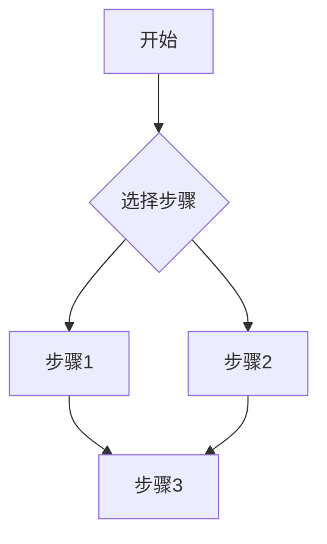

# Test case

## subtitle

### subsubtitle

#### subsubsubtitle

---
Here is your Python code running in web
```python
import numpy as np
import pandas as pd
import time

x = 10
y = 20

df = pd.DataFrame({'A': [1, 2, 3]})
time.sleep(5)
print(df)
```


**Hello world!**
---
Here is a another code for your code:
```python
def add(a, b):
    return a + b
    
print(add(x,y))
```


Here is r code for code test:
```r
x <- c(1, 2, 3)
mean(x)
max(x)
min(x)
```


---

The next part is math latex expression:
The **electroweak theory Lagrangian density** describes the unification of the electromagnetic and weak interactions, which is a cornerstone of the Standard Model of particle physics. Below is the Lagrangian:

$$
\mathcal{L} = -\frac{1}{4}W_{\mu\nu}^a W^{a\mu\nu} - \frac{1}{4}B_{\mu\nu}B^{\mu\nu} + i\bar{\psi}\gamma^\mu D_\mu \psi - \frac{1}{2}(D_\mu \phi)^\dagger (D^\mu \phi) - V(\phi)
$$

---
Mindmaps can be created by simply writing the items as a Markdown list within the markmap code block, indenting each item to create as many sub-levels as you need:

```markmap {height="200px"}
- Hugo Modules
  - Hugo Blox
  - blox-plugins-netlify
  - blox-plugins-netlify-cms
  - blox-plugins-reveal
```

And can support mermaid style:


---
Embedding external youtube video:

https://www.youtube.com/watch?v=dQw4w9WgXcQ

bilibili video:

[here is bilibili video](https://www.bilibili.com/video/BV1Sz411e7XX)

